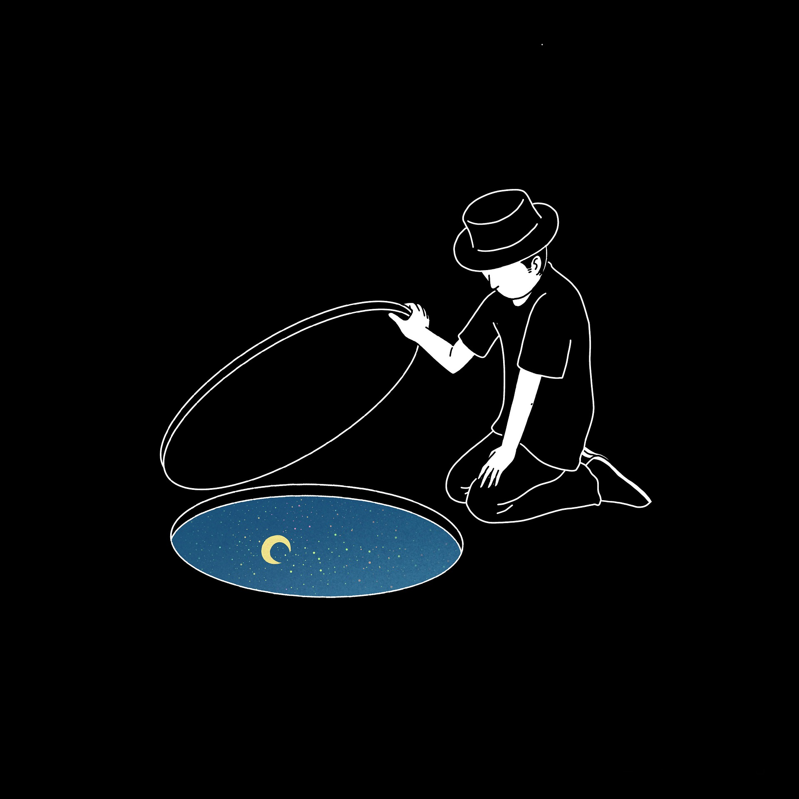

```{r setup, include=FALSE}
knitr::opts_chunk$set(echo = TRUE)
```

# Presentación

Yo soy **Ronny Hernández Mora** y me gusta trabajar con *datos*

Si querés seguirme en redes sociales, podés hacerlo por mi cuenta de [twitter](https://twitter.com/RonnyHdezM)

## Actividades que me gustan

 - Leer libros
 - Andar en bicicleta
 - Jugar con arduinos (aunque estoy implica estar en la compu)

### Cursos que he tomado

| Curso | Del 1 al 5 qué tanto me gustó |
| ----- | ----------------------------- |
| estadistica | 4 |
| r | 5 |


| celda 1 | celda 2 |
| ------- | -------- |
| valor 1 | valor 2 |
| valor 3 | valor 4 |


#### Incluir una imagen

Esta es una imagen




	
